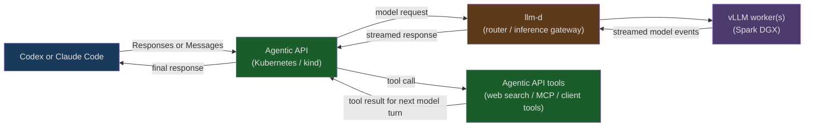

# Run Agentic API on kind

This guide runs a single Agentic API replica on a local [kind](https://kind.sigs.k8s.io/)
cluster. It is intended for development and smoke testing, not production deployment.

The example assumes that vLLM or an llm-d inference gateway is already running on the
host. Agentic API runs in kind and reaches the upstream through `host.docker.internal`.

!!! warning

    The example uses a local SQLite database inside the pod. The database is lost when
    the pod is removed, and this setup is limited to one replica. Use PostgreSQL and a
    persistent volume for a real deployment.

## Use llm-d as the inference backend

The same topology can place [llm-d](https://llm-d.ai/) between Agentic API and
the vLLM workers. This is the deployment pattern validated on a Spark DGX:
llm-d owns inference routing and presents an OpenAI-compatible upstream endpoint,
while Agentic API owns response state, tool orchestration, and the agent loop.



For this arrangement, configure Agentic API's upstream URL to the llm-d
endpoint rather than directly to a vLLM worker. The Deployment below uses a
host alias because the local kind pod reaches the tested llm-d/vLLM stack on the
host; in a Kubernetes deployment where llm-d is a Service, use the Service DNS
name instead. The tool loop remains in Agentic API: a model tool call is
executed or returned to the client, and the resulting turn is sent back through
llm-d for inference.

## Prerequisites

Install and verify:

```console
docker version
kind version
kubectl version --client
```

You need an inference endpoint reachable from Docker at
`host.docker.internal:5050`. This can be vLLM directly, or the llm-d endpoint
fronting the vLLM workers. For a direct vLLM smoke test, start vLLM on the host with:

```console
vllm serve Qwen/Qwen3-30B-A3B-FP8 \
  --tool-call-parser qwen3_coder \
  --enable-auto-tool-choice \
  --reasoning-parser qwen3 \
  --host 0.0.0.0 \
  --port 5050
```

The `--host 0.0.0.0` setting matters because the vLLM process must accept traffic
from the Docker network.

## Build the local image

The repository includes `Dockerfile.kind`, a multi-stage Linux build that works when
the repository is checked out on macOS as well as Linux. The `.dockerignore` file
keeps local build output out of the Docker context. The contents of
`Dockerfile.kind` are:

```dockerfile
FROM rust:1.96.0-bookworm AS build

WORKDIR /src
COPY . .
RUN cargo build --release -p agentic-server

FROM debian:bookworm-slim

RUN apt-get update \
    && apt-get install --no-install-recommends --yes ca-certificates \
    && rm -rf /var/lib/apt/lists/*

COPY --from=build /src/target/release/agentic-server /usr/local/bin/agentic-server

EXPOSE 9000
ENTRYPOINT ["/usr/local/bin/agentic-server"]
```

Build the image and load it into kind:

```console
docker build -f Dockerfile.kind -t agentic-api:kind .
kind create cluster --name agentic-api
kind load docker-image agentic-api:kind --name agentic-api
```

If the cluster already exists, skip `kind create cluster` and load the image again
after rebuilding it.

### Podman

Podman can run kind through its experimental provider. Start a Podman machine first,
then use the provider environment variable for both cluster operations:

```console
podman machine start
KIND_EXPERIMENTAL_PROVIDER=podman kind create cluster --name agentic-api-podman
KIND_EXPERIMENTAL_PROVIDER=podman kind load docker-image agentic-api:kind --name agentic-api-podman
```

In the Deployment below, replace `host.docker.internal` with
`host.containers.internal` when using Podman. The latter is the hostname Podman
provides for reaching services on the host.

## Deploy Agentic API

Apply the following Deployment and Service. The `host.docker.internal` address is
available in Docker Desktop. On native Linux Docker, that hostname does not resolve
inside the cluster, so you must also add the `hostAliases` block shown in the section
below before applying the manifest.

```yaml
apiVersion: apps/v1
kind: Deployment
metadata:
  name: agentic-api
spec:
  replicas: 1
  selector:
    matchLabels:
      app: agentic-api
  template:
    metadata:
      labels:
        app: agentic-api
    spec:
      containers:
        - name: agentic-api
          image: agentic-api:kind
          imagePullPolicy: IfNotPresent
          args:
            - --llm-api-base
            - http://host.docker.internal:5050
          env:
            - name: DATABASE_URL
              value: sqlite:///tmp/agentic_api.db
          ports:
            - name: http
              containerPort: 9000
          readinessProbe:
            httpGet:
              path: /ready
              port: http
            periodSeconds: 5
            failureThreshold: 30
          livenessProbe:
            httpGet:
              path: /health
              port: http
            periodSeconds: 10
---
apiVersion: v1
kind: Service
metadata:
  name: agentic-api
spec:
  selector:
    app: agentic-api
  ports:
    - name: http
      port: 9000
      targetPort: http
```

Save the YAML as `agentic-api-kind.yaml`, then apply it:

```console
kubectl apply -f agentic-api-kind.yaml
kubectl rollout status deployment/agentic-api
kubectl get pods,svc
```

On native Linux Docker, `host.docker.internal` never resolves inside the pod, so
add this block below `spec.template.spec` in the Deployment before applying the
manifest:

```yaml
      hostAliases:
        - ip: "172.18.0.1"
          hostnames:
            - host.docker.internal
```

The IP must be the gateway of the `kind` Docker network, not the default bridge:
kind nodes run on their own network, so the usual `172.17.0.1` bridge gateway is
not reachable from the pod. Confirm the address with:

```console
docker network inspect kind \
  --format '{{range .IPAM.Config}}{{.Gateway}} {{end}}'
```

## Call the API

Forward the Service to the host:

```console
kubectl port-forward service/agentic-api 9000:9000
```

In another terminal, check both probes:

```console
curl http://localhost:9000/health
curl http://localhost:9000/ready
```

Make a stateful Responses API request:

```console
curl http://localhost:9000/v1/responses \
  -H 'Content-Type: application/json' \
  -d '{
    "model": "Qwen/Qwen3-30B-A3B-FP8",
    "input": "Say hello from kind."
  }'
```

The model name must match the model served by vLLM. View gateway logs while testing:

```console
kubectl logs -f deployment/agentic-api
```

## Optional web search

To enable the gateway-executed `web_search` built-in tool, add the provider settings
to the Deployment’s container environment:

```yaml
            - name: YOU_API_KEY
              valueFrom:
                secretKeyRef:
                  name: agentic-api-secrets
                  key: you-api-key
            - name: YOU_API_BASE_URL
              value: https://api.you.com
```

Create the secret before applying the Deployment:

```console
kubectl create secret generic agentic-api-secrets \
  --from-literal=you-api-key="$YOU_API_KEY"
```

Do not commit API keys to the manifest or source tree.

## Optional: deploy with llm-d

`--llm-api-base` accepts any OpenAI-compatible endpoint, not only a single vLLM
server. Pointing it at an inference gateway backed by
[llm-d](https://llm-d.ai/) and the
[Gateway API Inference Extension](https://gateway-api-inference-extension.sigs.k8s.io/)
lets one Agentic API instance serve multiple models (the gateway routes on the
request's `model` field) and lets the endpoint picker (EPP) place each request
on the vLLM replica that already holds the matching KV-cache prefix. Because
stateful Responses continuations rehydrate the full conversation history,
prefix-aware placement substantially reduces continuation latency for
multi-turn workloads; see the measurements in
[ADR-04](https://github.com/vllm-project/agentic-api/issues/69).

The steps below add the routing plane to the kind cluster from this guide.
They keep vLLM on the host, as elsewhere in this guide; each host server is
represented inside the cluster by a small TCP proxy pod so the `InferencePool`
can select and monitor it. On a real cluster, vLLM runs as in-cluster pods and
the pool selects them directly - the proxy pods are only the local-development
bridge, and the EPP scrapes vLLM metrics through them transparently.

### Install the routing plane

Install the Gateway API and Inference Extension CRDs, then
[Agentgateway](https://agentgateway.dev/) as the gateway implementation:

```console
kubectl apply -f https://github.com/kubernetes-sigs/gateway-api/releases/download/v1.4.0/standard-install.yaml
kubectl apply -f https://github.com/kubernetes-sigs/gateway-api-inference-extension/releases/download/v1.5.0/manifests.yaml
helm upgrade -i --create-namespace --namespace agentgateway-system --version v1.0.0 \
  agentgateway-crds oci://cr.agentgateway.dev/charts/agentgateway-crds
helm upgrade -i --namespace agentgateway-system --version v1.0.0 \
  agentgateway oci://cr.agentgateway.dev/charts/agentgateway \
  --set inferenceExtension.enabled=true
```

### Create the pool backends and Gateway

Save and apply the following as `llm-pool.yaml`. The proxy pod forwards pool
traffic to the host vLLM server; the IP is the `kind` network gateway described
in the `hostAliases` section above. To scale the pool, start more vLLM servers
on additional host ports and add one labeled proxy pod per server:

```yaml
apiVersion: v1
kind: Pod
metadata:
  name: vllm-replica-1
  labels:
    app: vllm-pool
spec:
  containers:
    - name: proxy
      image: alpine/socat:1.8.0.0
      args: ["TCP-LISTEN:8000,fork,reuseaddr", "TCP:172.18.0.1:5050"]
      ports:
        - containerPort: 8000
      readinessProbe:
        tcpSocket:
          port: 8000
        periodSeconds: 5
---
apiVersion: gateway.networking.k8s.io/v1
kind: Gateway
metadata:
  name: inference-gateway
spec:
  gatewayClassName: agentgateway
  listeners:
    - name: http
      port: 80
      protocol: HTTP
```

### Install the InferencePool and EPP

The Helm chart installs the `InferencePool`, the EPP, and an `HTTPRoute` bound
to the Gateway:

```console
helm install vllm-pool \
  --dependency-update \
  --set inferencePool.modelServers.matchLabels.app=vllm-pool \
  --set provider.name=none \
  --set experimentalHttpRoute.enabled=true \
  --version v1.5.0 \
  oci://registry.k8s.io/gateway-api-inference-extension/charts/inferencepool
```

On arm64 hosts the chart's default EPP image is amd64-only and crashes with
`exec format error`; switch it to the multi-arch llm-d scheduler build, which
is the same EPP framework:

```console
kubectl set image deployment/vllm-pool-epp \
  epp=ghcr.io/llm-d/llm-d-inference-scheduler:latest
```

Verify the path end to end before involving Agentic API:

```console
kubectl port-forward svc/inference-gateway 8080:80 &
curl http://localhost:8080/v1/models
```

### Point Agentic API at the gateway

In the Deployment from this guide, replace the `--llm-api-base` value with the
gateway Service URL and apply it again:

```yaml
          args:
            - --llm-api-base
            - http://inference-gateway.default.svc.cluster.local:80
```

The readiness probe works unchanged: `/ready` checks vLLM `/health` through the
gateway, which routes it to a pool member. Requests to `/v1/responses` now flow
client -> Agentic API -> gateway -> EPP-selected vLLM replica.

## Troubleshooting

### The pod stays unready

`/ready` checks the configured vLLM `/health` endpoint. Inspect the pod logs and verify
that vLLM is listening on `0.0.0.0:5050` and that the configured host address is
reachable from Docker:

```console
kubectl describe pod -l app=agentic-api
kubectl logs deployment/agentic-api
docker run --rm curlimages/curl:8.10.1 \
  http://host.docker.internal:5050/health
```

On native Linux Docker, run the connectivity check on the `kind` network against
its gateway instead, since `host.docker.internal` does not resolve:

```console
docker run --rm --network kind curlimages/curl:8.10.1 \
  http://172.18.0.1:5050/health
```

### The image is not refreshed

kind uses the image already loaded into its node. Rebuild and load it explicitly, then
restart the Deployment:

```console
docker build -f Dockerfile.kind -t agentic-api:kind .
kind load docker-image agentic-api:kind --name agentic-api
kubectl rollout restart deployment/agentic-api
```

### Inspect the rendered configuration

```console
kubectl get deployment agentic-api -o yaml
kubectl get events --sort-by=.lastTimestamp
```

## Clean up

Delete the Kubernetes resources and the kind cluster when finished:

```console
kubectl delete -f agentic-api-kind.yaml
kind delete cluster --name agentic-api
```

The temporary `agentic-api-kind.yaml` file can then be removed from the repository
checkout.
